# Anomaly Detection

This is my Masters Project Laboratory 2 project about anomaly detection using machine learning

# Comparison of different types of anomaly detection

## Statistics

Statistics-based approaches work well for simpler well-defined datasets, where assumptions can be made about the data distribution (or the distribution of the data is known)  
Some examples:
- Percentile-based detection/Set static thresholds based on past data, where the model marks exceeding values as anomalies (most basic approach)
- Z-Score: count number of categories that deviate from their mean by a threshold and mark samples which exceed a set number of allowed deviations as anomalies
- Covariance Matrix: build covariance matrix from past data, values that deviate from expected covariance more than an allowed threshold are marked as anomalies
- Grubbs Test: used with normal distributions, where the model marks samples that deviate from the normal distribution more than a threshold as outliers

Advantages:
- Easy to implement
- Works well when data follows a known distribution

Disadvantages:
- Requires assumptions about the data distribution
- Doesn't work well for non-linear/high-dimensional data

Used mostly by financial institutions or healthcare providers

## Machine Learning

Use of machine learning is better for complex, large and variable datasets. The models tune their definition of anomalies based on a provided dataset

### Supervised Learning

Has access to labeled data of normal and anomalous examples  
Some examples:
- K-nearest neighbors
- Linear/Polynomial regression
- Decision trees
- Random Forests
- Support Vector Machines
- Gradient Boosting
- Neural Networks

Advantages:
- Can be used for a wide range of datasets
- Can learn complex relationships between features
- Performs well when provided with large enough labeled data

Disadvantages:
- Requires labeled data, which may be expensive to obtain
- Can struggle with rare anomalies that were not seen during training

Used when labeled data is available, for example transaction fraud detection

### Unsupervised Learning

When there is no access to labeled data, models find their own relations to determine anomalies  
Some examples:
- K means clustering
- DBSCAN (Density-Based Spatial Clustering)
- Isolation forest
- Local Outlier Factor
- Autoencoders (deep learning)

Advantages:
- Doesn't require labeled data
- Can be used for a wide range of datasets
- Can learn complex relationships between features
- Can detect novel anomalies

Disadvantages:
- Usually not as accurate as supervised learning
- Can be harder to train

Used when labeled data is not available, for example network anomaly detection

### Semi-supervised Learning

Some labeled and unlabeled data, acts like supervised learning for labeled data, and tries to approximate for unlabeled data  

Usually less accurate than supervised learning, but can be useful in cases where only a small set of labeled data is available with a lot of unlabeled data and labeling is expensive

### Deep learning

Artificial neural networks with a large number of layers can be useful for identifying anomalies in complex datasets, where other methods could not work well enough  
Some examples:
- Autoencoders
- Generative Adversarial Networks

Advantages:
- Can learn complex/high-dimensional relationships between features
- Can detect novel anomalies
- Can be used for a wide range of datasets that can be very large

Disadvantages:
- Can be harder to train and interpret
- Can be computationally expensive
- Requires a lot of data to train

Used for complex/high-dimensional datasets, for example when working with images

## Time Series based

Time series based approaches focus on patters over time, where anomalies are defined as deviations from the normal patterns, such as spikes or drops in the data  
Some examples:
- Autoregressive Integrated Moving Average (ARIMA)
- Exponential Smoothing (ETS)
- LSTM (Long Short Term Memory) based models

Advantages:
- Effective at detecting seasonal or cyclical patterns

Disadvantages:
- Sensitive to seasonal patterns

Used for time series data, for example power consumption or network traffic

## Graph based

Graph based methods detect anomalies by analyzing the relationships and interactions between entities, often modeled as a graph  
Some examples:
- Graph Convolutional Networks (GCN)
- PageRank
- Random Walks

Advantages:
- Can detect complex relationships between entities
- Can capture both local and global patterns

Disadvantages:
- Can be computationally expensive
- Requires well structured data

Used by social media platforms, for example to detect fake accounts or suspicious behavior

---

# Results of comparison

## On labeled dataset

Used dataset: https://huggingface.co/datasets/pointe77/credit-card-transaction/tree/main

### Isolation Forest
Train time: ~6 seconds

|              | precision | recall | f1-score | support |
|--------------|-----------|--------|----------|---------|
| 0.0          | 1.00      | 0.97   | 0.98     | 553574  |
| 1.0          | 0.02      | 0.21   | 0.04     | 2145    |
| accuracy     |           |        | 0.96     | 555719  |
| macro avg    | 0.51      | 0.59   | 0.51     | 555719  |
| weighted avg | 0.99      | 0.96   | 0.98     | 555719  |

---

### Local Outlier Factor
Train time: ~1202 seconds

|              | precision | recall | f1-score | support |
|--------------|-----------|--------|----------|---------|
| 0.0          | 1.00      | 0.63   | 0.77     | 553574  |
| 1.0          | 0.00      | 0.24   | 0.00     | 2145    |
| accuracy     |           |        | 0.63     | 555719  |
| macro avg    | 0.50      | 0.44   | 0.39     | 555719  |
| weighted avg | 0.99      | 0.63   | 0.77     | 555719  |

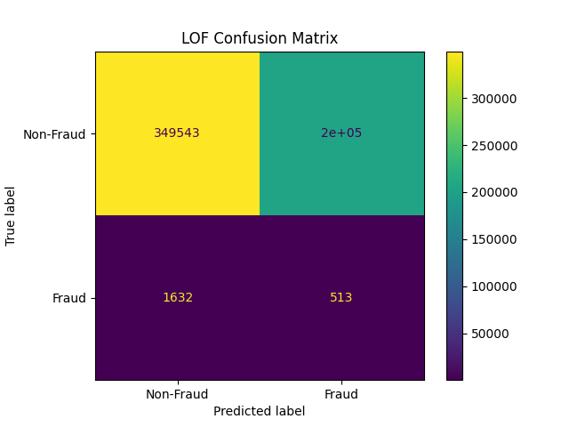

---

### One-Class SVM
Train time: ~2067 seconds

|              | precision | recall | f1-score | support |
|--------------|-----------|--------|----------|---------|
| 0.0          | 1.00      | 0.85   | 0.92     | 553574  |
| 1.0          | 0.01      | 0.32   | 0.02     | 2145    |
| accuracy     |           |        | 0.85     | 555719  |
| macro avg    | 0.50      | 0.58   | 0.47     | 555719  |
| weighted avg | 0.99      | 0.85   | 0.91     | 555719  |

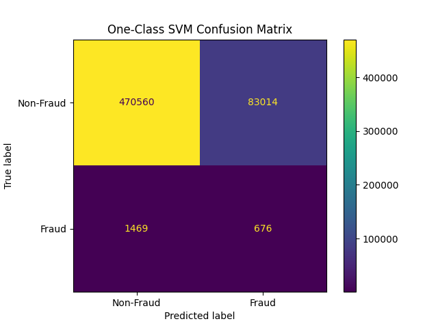

---

### K-Means
Train time: ~0 seconds

|              | precision | recall | f1-score | support |
|--------------|-----------|--------|----------|---------|
| 0.0          | 1.00      | 0.54   | 0.70     | 553574  |
| 1.0          | 0.00      | 0.46   | 0.01     | 2145    |
| accuracy     |           |        | 0.54     | 555719  |
| macro avg    | 0.50      | 0.50   | 0.35     | 555719  |
| weighted avg | 0.99      | 0.54   | 0.70     | 555719  |

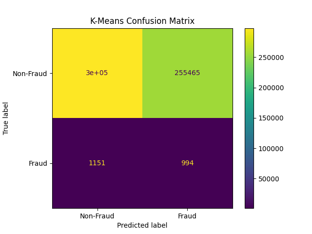

---

### Autoencoder

|              | precision | recall | f1-score | support |
|--------------|-----------|--------|----------|---------|
| 0.0          | 1.00      | 0.98   | 0.99     | 553574  |
| 1.0          | 0.04      | 0.19   | 0.06     | 2145    |
| accuracy     |           |        | 0.98     | 555719  |
| macro avg    | 0.52      | 0.59   | 0.53     | 555719  |
| weighted avg | 0.99      | 0.98   | 0.99     | 555719  |

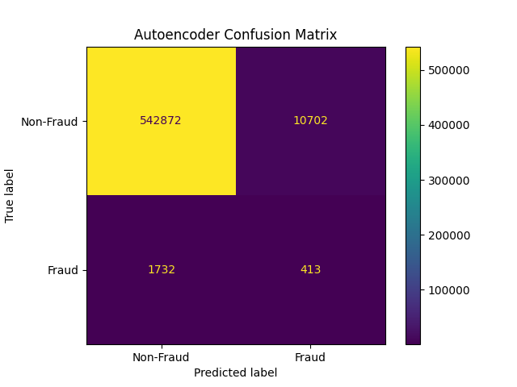

---

### PR + ROC Curves

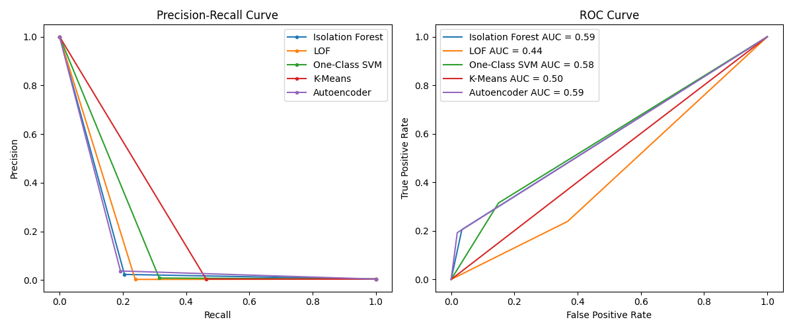

---

## On anonymized credit card fraud dataset

Used dataset: https://www.kaggle.com/datasets/mlg-ulb/creditcardfraud/data  
There are 2 versions, one with SMOTE-ENN (Synthetic Minority Over-sampling Technique + Edited Nearest Neighbors) and one without.  
The confusion matrices are for the default model, which is the one without SMOTE-ENN. Confusion matrices for the SMOTE-ENN model are in the 'images' folder.

### Isolation Forest

Default Train time: ~1 second

|              | precision | recall | f1-score | support |
|--------------|-----------|--------|----------|---------|
| 0.0          | 1.00      | 0.98   | 0.99     | 71108   |
| 1.0          | 0.04      | 0.60   | 0.07     | 94      |
| accuracy     |           |        | 0.98     | 71202   |
| macro avg    | 0.52      | 0.79   | 0.53     | 71202   |
| weighted avg | 1.00      | 0.98   | 0.99     | 71202   |

SMOTE-ENN Train time: ~0 seconds

|              | precision | recall | f1-score | support |
|--------------|-----------|--------|----------|---------|
| 0.0          | 1.00      | 0.96   | 0.98     | 71108   |
| 1.0          | 0.03      | 0.77   | 0.05     | 94      |
| accuracy     |           |        | 0.96     | 71202   |
| macro avg    | 0.51      | 0.86   | 0.52     | 71202   |
| weighted avg | 1.00      | 0.96   | 0.98     | 71202   |

CTGAN:

|              | precision | recall | f1-score | support |
|--------------|-----------|--------|----------|---------|
| 0.0          | 1.00      | 0.96   | 0.98     | 71108   |
| 1.0          | 0.03      | 0.74   | 0.05     | 94      |
| accuracy     |           |        | 0.96     | 71202   |
| macro avg    | 0.51      | 0.85   | 0.51     | 71202   |
| weighted avg | 1.00      | 0.96   | 0.98     | 71202   |

---

### Local Outlier Factor

Train time: ~42 seconds

|              | precision | recall | f1-score | support |
|--------------|-----------|--------|----------|---------|
| 0.0          | 1.00      | 0.77   | 0.87     | 71108   |
| 1.0          | 0.00      | 0.14   | 0.00     | 94      |
| accuracy     |           |        | 0.77     | 71202   |
| macro avg    | 0.50      | 0.45   | 0.44     | 71202   |
| weighted avg | 1.00      | 0.77   | 0.87     | 71202   |

SMOTE-ENN Train time: ~34 seconds

|              | precision | recall | f1-score | support |
|--------------|-----------|--------|----------|---------|
| 0.0          | 1.00      | 0.76   | 0.86     | 71108   |
| 1.0          | 0.00      | 0.39   | 0.00     | 94      |
| accuracy     |           |        | 0.76     | 71202   |
| macro avg    | 0.50      | 0.58   | 0.43     | 71202   |
| weighted avg | 1.00      | 0.76   | 0.86     | 71202   |

CTGAN:

|              | precision | recall | f1-score | support |
|--------------|-----------|--------|----------|---------|
| 0.0          | 1.00      | 0.77   | 0.87     | 71108   |
| 1.0          | 0.00      | 0.14   | 0.00     | 94      |
| accuracy     |           |        | 0.77     | 71202   |
| macro avg    | 0.50      | 0.45   | 0.43     | 71202   |
| weighted avg | 1.00      | 0.77   | 0.87     | 71202   |

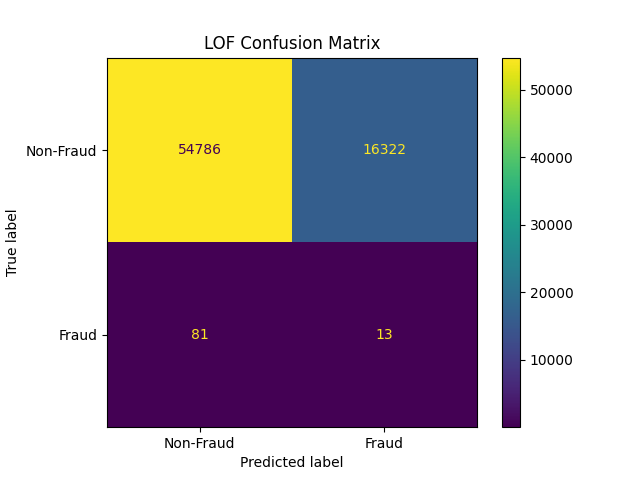

---

### One-Class SVM

Train time: ~97 seconds

|              | precision | recall | f1-score | support |
|--------------|-----------|--------|----------|---------|
| 0.0          | 1.00      | 0.98   | 0.99     | 71108   |
| 1.0          | 0.04      | 0.65   | 0.08     | 94      |
| accuracy     |           |        | 0.98     | 71202   |
| macro avg    | 0.52      | 0.81   | 0.54     | 71202   |
| weighted avg | 1.00      | 0.98   | 0.99     | 71202   |

SMOTE-ENN Train time: ~73 seconds

|              | precision | recall | f1-score | support |
|--------------|-----------|--------|----------|---------|
| 0.0          | 1.00      | 0.98   | 0.99     | 71108   |
| 1.0          | 0.05      | 0.70   | 0.10     | 94      |
| accuracy     |           |        | 0.98     | 71202   |
| macro avg    | 0.53      | 0.84   | 0.54     | 71202   |
| weighted avg | 1.00      | 0.98   | 0.99     | 71202   |

CTGAN:

|              | precision | recall | f1-score | support |
|--------------|-----------|--------|----------|---------|
| 0.0          | 1.00      | 0.98   | 0.99     | 71108   |
| 1.0          | 0.03      | 0.40   | 0.06     | 94      |
| accuracy     |           |        | 0.98     | 71202   |
| macro avg    | 0.52      | 0.69   | 0.52     | 71202   |
| weighted avg | 1.00      | 0.98   | 0.99     | 71202   |

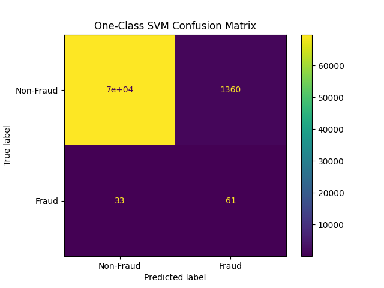

---

### K-Means

Train time: ~0 seconds

|              | precision | recall | f1-score | support |
|--------------|-----------|--------|----------|---------|
| 0.0          | 1.00      | 0.94   | 0.97     | 71108   |
| 1.0          | 0.00      | 0.17   | 0.01     | 94      |
| accuracy     |           |        | 0.94     | 71202   |
| macro avg    | 0.50      | 0.56   | 0.49     | 71202   |
| weighted avg | 1.00      | 0.94   | 0.97     | 71202   |

SMOTE-ENN Train time: ~0 seconds

|              | precision | recall | f1-score | support |
|--------------|-----------|--------|----------|---------|
| 0.0          | 1.00      | 0.06   | 0.11     | 71108   |
| 1.0          | 0.00      | 1.00   | 0.00     | 94      |
| accuracy     |           |        | 0.06     | 71202   |
| macro avg    | 0.50      | 0.53   | 0.06     | 71202   |
| weighted avg | 1.00      | 0.06   | 0.11     | 71202   |

CTGAN:

|              | precision | recall | f1-score | support |
|--------------|-----------|--------|----------|---------|
| 0.0          | 0.00      | 0.00   | 0.00     | 71108   |
| 1.0          | 0.00      | 0.54   | 0.00     | 94      |
| accuracy     |           |        | 0.00     | 71202   |
| macro avg    | 0.00      | 0.27   | 0.00     | 71202   |
| weighted avg | 0.00      | 0.00   | 0.00     | 71202   |

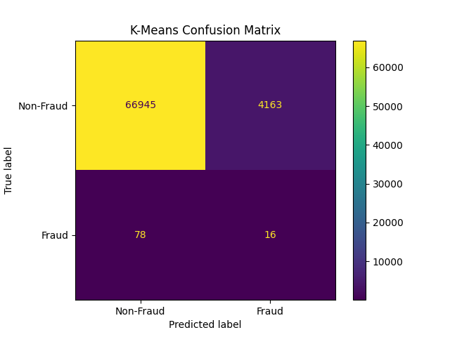

---

### Autoencoder

Train time: ~65 seconds

|              | precision | recall | f1-score | support |
|--------------|-----------|--------|----------|---------|
| 0.0          | 1.00      | 0.98   | 0.99     | 71108   |
| 1.0          | 0.05      | 0.70   | 0.09     | 94      |
| accuracy     |           |        | 0.98     | 71202   |
| macro avg    | 0.52      | 0.84   | 0.54     | 71202   |
| weighted avg | 1.00      | 0.98   | 0.99     | 71202   |

SMOTE-ENN Train time: ~54 seconds

|              | precision | recall | f1-score | support |
|--------------|-----------|--------|----------|---------|
| 0.0          | 1.00      | 0.95   | 0.97     | 71108   |
| 1.0          | 0.02      | 0.81   | 0.04     | 94      |
| accuracy     |           |        | 0.95     | 71202   |
| macro avg    | 0.51      | 0.88   | 0.51     | 71202   |
| weighted avg | 1.00      | 0.95   | 0.97     | 71202   |

CTGAN:

|              | precision | recall | f1-score | support |
|--------------|-----------|--------|----------|---------|
| 0.0          | 1.00      | 0.95   | 0.97     | 71108   |
| 1.0          | 0.02      | 0.82   | 0.04     | 94      |
| accuracy     |           |        | 0.95     | 71202   |
| macro avg    | 0.51      | 0.89   | 0.51     | 71202   |
| weighted avg | 1.00      | 0.95   | 0.97     | 71202   |

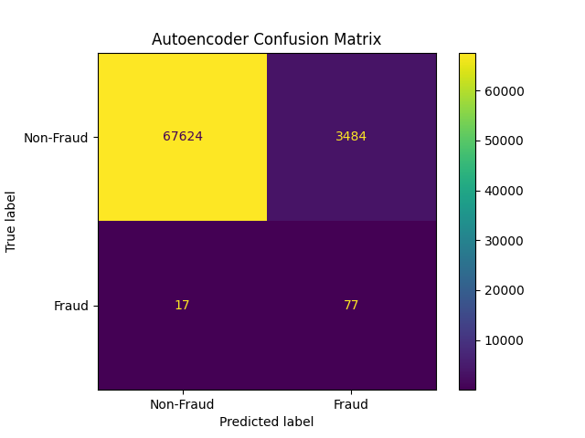

---

### Transformer

|              | precision | recall | f1-score | support |
|--------------|-----------|--------|----------|---------|
| 0.0          | 1.00      | 0.99   | 1.00     | 71108   |
| 1.0          | 0.10      | 0.68   | 0.18     | 94      |
| accuracy     |           |        | 0.99     | 71202   |
| macro avg    | 0.55      | 0.84   | 0.59     | 71202   |
| weighted avg | 1.00      | 0.99   | 0.99     | 71202   |

SMOTE-ENN:

|              | precision | recall | f1-score | support |
|--------------|-----------|--------|----------|---------|
| 0.0          | 1.00      | 0.99   | 1.00     | 71108   |
| 1.0          | 0.10      | 0.76   | 0.18     | 94      |
| accuracy     |           |        | 0.99     | 71202   |
| macro avg    | 0.55      | 0.87   | 0.59     | 71202   |
| weighted avg | 1.00      | 0.99   | 0.99     | 71202   |

CTGAN:

|              | precision | recall | f1-score | support |
|--------------|-----------|--------|----------|---------|
| 0.0          | 1.00      | 0.99   | 1.00     | 71108   |
| 1.0          | 0.10      | 0.76   | 0.18     | 94      |
| accuracy     |           |        | 0.99     | 71202   |
| macro avg    | 0.55      | 0.81   | 0.59     | 71202   |
| weighted avg | 1.00      | 0.99   | 0.99     | 71202   |

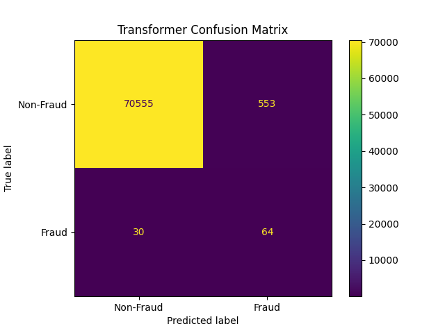

---

### PR + ROC Curves

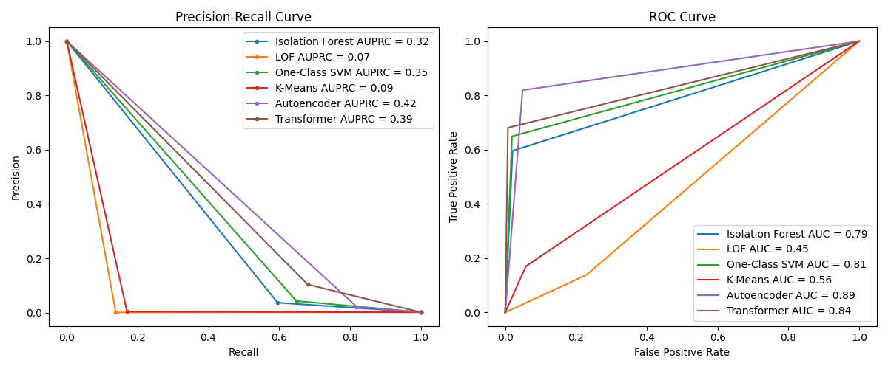

SMOTE-ENN:

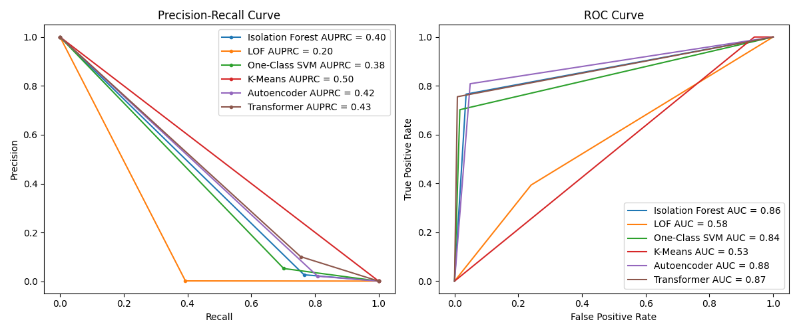

CTGAN:

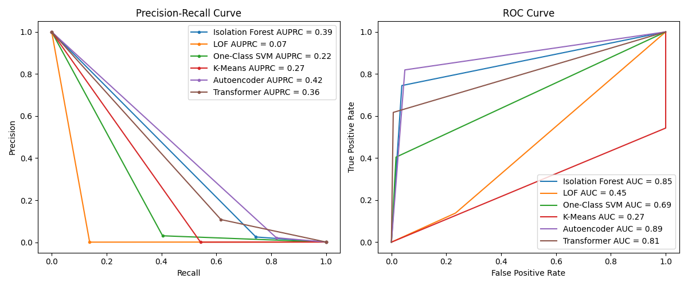

---

## On CIC-UNSW-NB15 network traffic dataset

Used dataset: https://www.unb.ca/cic/datasets/cic-unsw-nb15.html

### Isolation Forest

|              | precision | recall | f1-score | support |
|--------------|-----------|--------|----------|---------|
| 0.0          | 0.85      | 0.85   | 0.85     | 71666   |
| 1.0          | 0.40      | 0.40   | 0.40     | 17917   |
| accuracy     |           |        | 0.76     | 89583   |
| macro avg    | 0.63      | 0.63   | 0.63     | 89583   |
| weighted avg | 0.76      | 0.76   | 0.76     | 89583   |

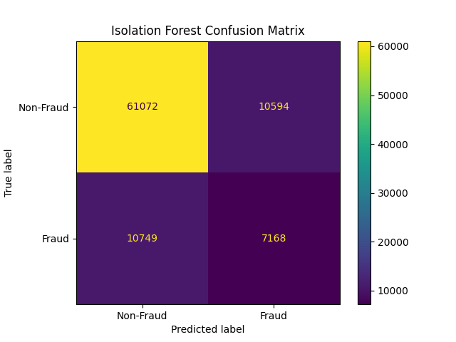

---

### Local Outlier Factor

|              | precision | recall | f1-score | support |
|--------------|-----------|--------|----------|---------|
| 0.0          | 0.79      | 0.78   | 0.79     | 71666   |
| 1.0          | 0.17      | 0.18   | 0.18     | 17917   |
| accuracy     |           |        | 0.66     | 89583   |
| macro avg    | 0.48      | 0.48   | 0.48     | 89583   |
| weighted avg | 0.67      | 0.66   | 0.66     | 89583   |

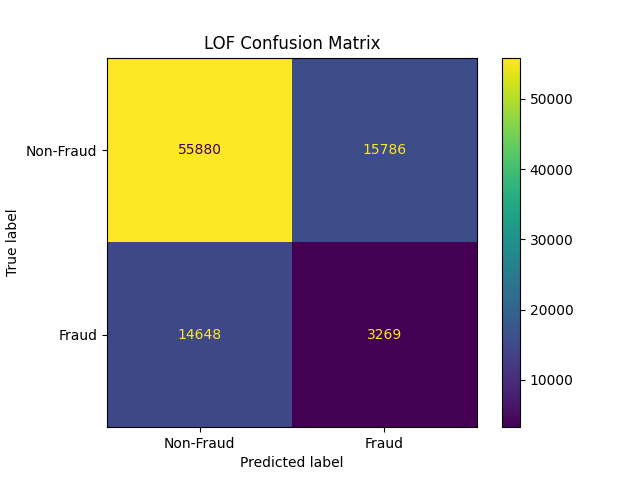

---

### One-Class SVM

|              | precision | recall | f1-score | support |
|--------------|-----------|--------|----------|---------|
| 0.0          | 0.80      | 1.00   | 0.89     | 71666   |
| 1.0          | 0.68      | 0.02   | 0.03     | 17917   |
| accuracy     |           |        | 0.80     | 89583   |
| macro avg    | 0.74      | 0.51   | 0.46     | 89583   |
| weighted avg | 0.78      | 0.80   | 0.72     | 89583   |

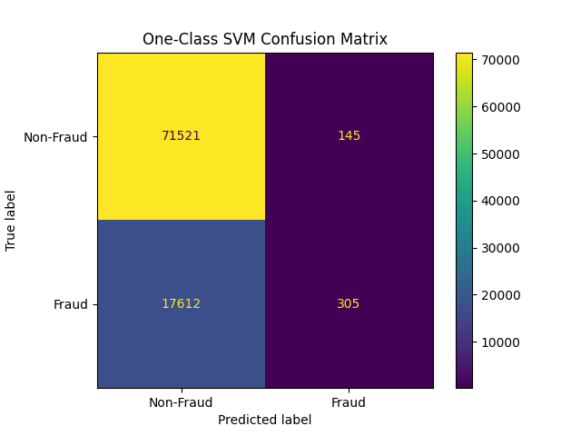

---

### K-Means

|              | precision | recall | f1-score | support |
|--------------|-----------|--------|----------|---------|
| 0.0          | 0.80      | 1.00   | 0.89     | 71666   |
| 1.0          | 0.94      | 0.00   | 0.01     | 17917   |
| accuracy     |           |        | 0.80     | 89583   |
| macro avg    | 0.87      | 0.50   | 0.45     | 89583   |
| weighted avg | 0.83      | 0.80   | 0.71     | 89583   |

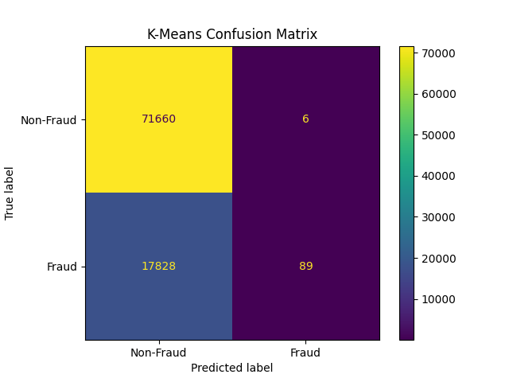

---

### Autoencoder

|              | precision | recall | f1-score | support |
|--------------|-----------|--------|----------|---------|
| 0.0          | 0.81      | 0.96   | 0.88     | 71666   |
| 1.0          | 0.42      | 0.11   | 0.17     | 17917   |  
| accuracy     |           |        | 0.79     | 89583   |
| macro avg    | 0.62      | 0.53   | 0.52     | 89583   |
| weighted avg | 0.73      | 0.79   | 0.74     | 89583   |

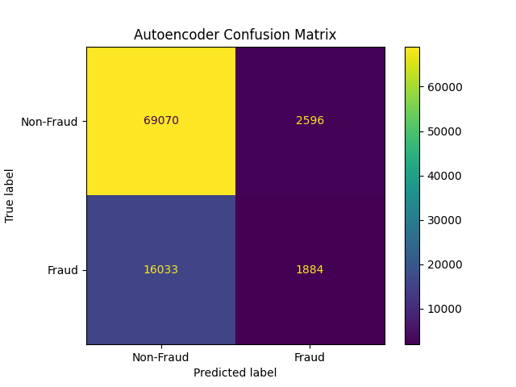

---

### Transformer

|              | precision | recall | f1-score | support |
|--------------|-----------|--------|----------|---------|
| 0.0          | 1.00      | 0.97   | 0.99     | 71666   |
| 1.0          | 0.90      | 1.00   | 0.95     | 17917   |
| accuracy     |           |        | 0.98     | 89583   | 
| macro avg    | 0.95      | 0.99   | 0.97     | 89583   |
| weighted avg | 0.98      | 0.98   | 0.98     | 89583   |

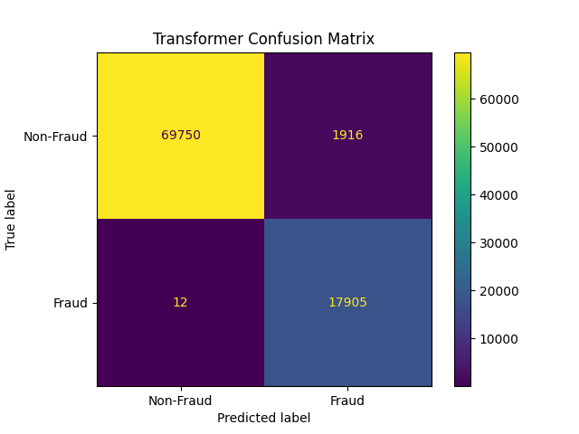

---

### One-Class Nearest Neighbors

|              | precision | recall | f1-score | support |
|--------------|-----------|--------|----------|---------|
| 0.0          | 0.82      | 0.98   | 0.90     | 71666   |
| 1.0          | 0.67      | 0.17   | 0.27     | 17917   |
| accuracy     |           |        | 0.82     | 89583   |
| macro avg    | 0.75      | 0.57   | 0.58     | 89583   |
| weighted avg | 0.79      | 0.82   | 0.77     | 89583   |

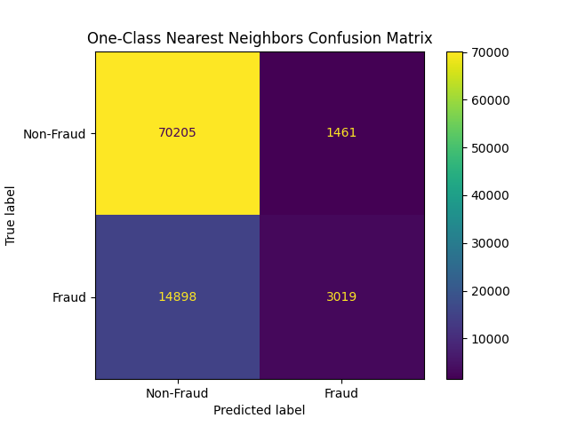

---

### PR + ROC Curves

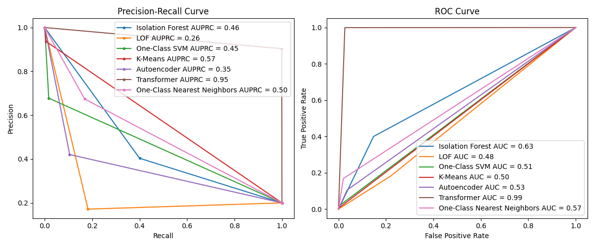

---

## On bot detection dataset

### Random Forest

Train time: ~1034 seconds ( ~17 minutes)

|              | precision | recall | f1-score | support |
|--------------|-----------|--------|----------|---------|
| 0.0          | 1.00      | 1.00   | 1.00     | 1193508 |
| 1.0          | 1.00      | 1.00   | 1.00     | 309418  |
| accuracy     |           |        | 1.00     | 1502926 |
| macro avg    | 1.00      | 1.00   | 1.00     | 1502926 |
| weighted avg | 1.00      | 1.00   | 1.00     | 1502926 |

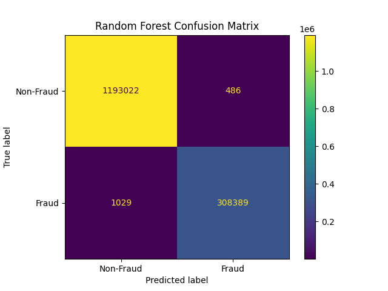

---

### XGBoost

Train time: ~20 seconds

|              | precision | recall | f1-score | support |
|--------------|-----------|--------|----------|---------|
| 0.0          | 0.99      | 1.00   | 0.99     | 1193508 |
| 1.0          | 0.99      | 0.96   | 0.97     | 309418  |
| accuracy     |           |        | 0.99     | 1502926 |
| macro avg    | 0.99      | 0.98   | 0.98     | 1502926 |
| weighted avg | 0.99      | 0.99   | 0.99     | 1502926 |

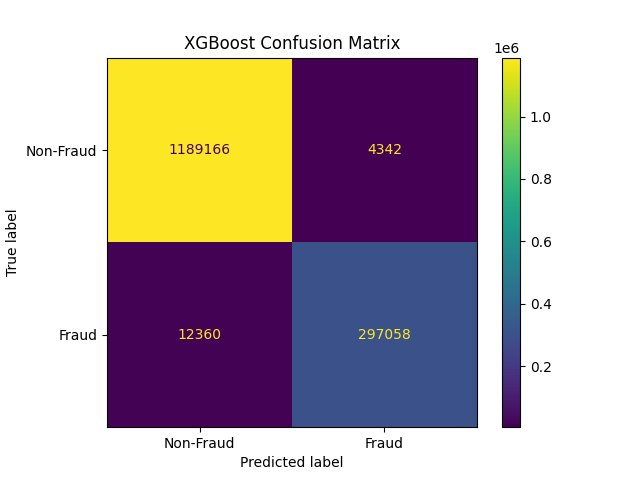

---

### PR + ROC Curves

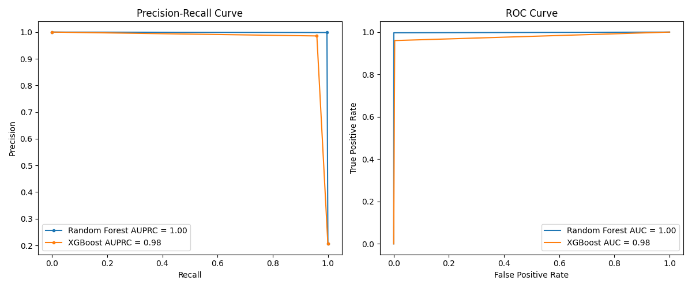

---

## 1. Week

### Progress

Looked into and added comparison of different types of anomaly detection techniques  
Found potential datasets, that can be used for the project:
- https://www.kaggle.com/datasets/faizaniftikharjanjua/metaverse-financial-transactions-dataset
- https://www.kaggle.com/datasets/cynthiarempel/amazon-us-customer-reviews-dataset  

Credit card fraud datasets:
- https://www.kaggle.com/datasets/mlg-ulb/creditcardfraud
- https://www.kaggle.com/datasets/kelvinkelue/credit-card-fraud-prediction
- https://data.world/vlad/credit-card-fraud-detection  

Network anomaly detection datasets:
- https://www.kaggle.com/datasets/kaiser14/network-anomaly-dataset?select=network_dataset_labeled.csv
- https://www.kaggle.com/datasets/aymenabb/ddos-evaluation-dataset-cic-ddos2019

### Next week's goals

- Select used dataset
- Find a base architecture for the model
- Test dataset with simpler methods for comparison

---

## 2. Week

### Progress

Found more credit card fraud datasets, this one has labeled columns:
- https://huggingface.co/datasets/pointe77/credit-card-transaction/tree/main

And this one has a lot of recent data, but no labeled columns:
- https://www.kaggle.com/datasets/nelgiriyewithana/credit-card-fraud-detection-dataset-2023

Added a comparison of the results of 4 different models on the labeled column credit card transaction dataset, I used Isolation Forest, Local Outlier Factor, One-Class SVM and K-Means clustering.

### Next week's goals

- Improve model parameters
- Explain the results
- Add an initial Deep Learning model and compare it with the others
- Maybe try another dataset
- Separate data reading and model training into separate files

---

## 3. Week

### Progress

Added model saving and loading, extracted the data loading and pre-processing into a separate file.  
Added an Autoencoder model and compared it with the other models.

### Next week's goals

- Improve model parameters
- Add short explanation of comparison metrics
- Improve Autoencoder architecture or try other deep learning models
- Extract paths to a config file

---

## 4. Week

### Progress

Added area under the precision-recall curve (AUPRC) metric to the PRC comparison plot, as this works better for imbalanced datasets.[[1]](#1)  
Looked for datasets and models in other papers about anomaly detection.  
Added data loading and comparison for the "Credit Card Fraud Detection" dataset from mlg-ulb, as this dataset is used as a benchmark in a lot of anomaly detection papers.  
Added SMOTE-ENN (Synthetic Minority Over-sampling Technique + Edited Nearest Neighbors) to the new dataset's loading step, because it improves the accuracy of the models according to this paper.[[2]](#2)

### Next week's goals

- Look into data simulation
- Look for dataset other than credit card fraud detection that is not anonymized?
- Add deep learning models other than autoencoders

---

## 5. Week

### Progress

Looked into which deep learning models work best for anomaly detection, and found that Transformer models work really well for tabular data (like the credit card fraud dataset).[[3]](#3)  
Added a Transformer model to the project and compared it with the other models.  
Looked for data generation methods that can be used to generate synthetic data for anomaly detection.
Potential data generation methods:
- Synthetic Minority Over-sampling Technique (SMOTE) (Like I tried previously)
- CTGAN (Conditional Tabular Generative Adversarial Networks) [[4]](#4), implemented in the SDV library [[5]](#5). Could be used for expanding small but labeled datasets
- Faker library with extra providers [[6]](#6) could be used to turn anonymized data into fake data

### Next week's goals

- Tune parameters of models (especially Transformer)
- Use data generation methods to improve model performance

---

## 6. Week

### Progress

Added a CTGAN-based data generation method to the data loader, which is used to augment the training data with synthetic frauds.  
This method resulted in worse results than the SMOTE-ENN method or the default dataset, so it might not be a good fit for this use case.  
Added a presentation for week 6 that covers my progress on the project so far.  
I looked into datasets for other anomaly detection tasks, which are non-anonymized and not as unbalanced in terms of anomaly ratio, and I found the following:  
Network traffic:
- https://www.unb.ca/cic/datasets/ids-2018.html
- https://www.unb.ca/cic/datasets/cic-unsw-nb15.html (Has multiple different anomaly types)  

Industrial Control Systems:
- https://paperswithcode.com/dataset/swat-a7 (Water Treatment Plant)  

Machinery monitoring:
- https://data.nasa.gov/Raw-Data/IMS-Bearings/brfb-gzcv/about_data (Nasa Bearings Dataset)

### Next week's goals

- Look for other types of datasets (not just credit card fraud) that have non-anonymized data
- Choose a new type of anomaly detection task to test on
- Tune parameters of models (especially Transformer)
- Run tests on first dataset

---

## 7. Week

### Progress

Added the CIC-UNSW-NB15 dataset to the project, which is a network traffic dataset with benign and malicious traffic.[[7]](#7)  
I chose this dataset, and not the other ones I listed, because it is fairly recent, has a large amount of data, it is more balanced in terms of anomaly ratio (20%), and it was easily accessible.  
Added comparison of the results of the 6 models on the CIC-UNSW-NB15 dataset.  
Notably, the Transformer model performed the best by a very wide margin, the other models might have a problem with this dataset for some reason, as they performed quite poorly, I'll have to investigate this further.
Added an initial Flask based frontend for the project, which allows the user to select a model and evaluate it on a test dataset.

### Next week's goals

- Improve the Flask based frontend (make it look nicer, add more functionality)
- Check if the performance of the models (other than the Transformer) can be improved on the CIC-UNSW-NB15 dataset
- Add mocked live data generation to the project and some way to visualize it on the frontend

---

## 8. Week

### Progress

I improved the frontend part of the project:
- Changed to material design
- Added the option to compare results of different models
- Added table for classification report
- Added loading animation while the models are predicting  

Cleaned up data loader creation and usage.  
I also added a CTGAN based data generator, that I can use to approximate fresh live data.  

I started working on the frontend display of the live data prediction chart, but it is not fully functional yet.

Sample images of the Flask frontend:  
Initial page:  
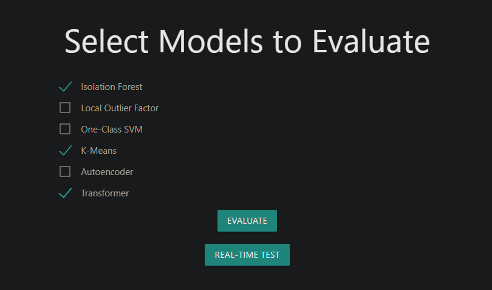

Comparison results page:

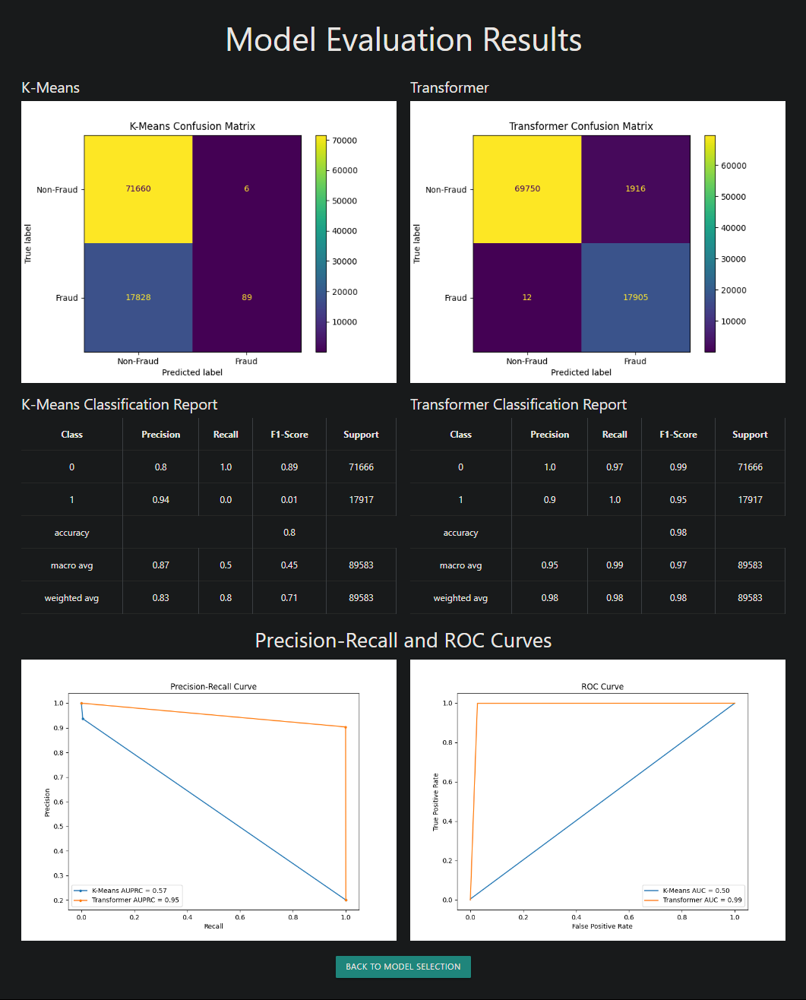

Prototype of the live data prediction page:

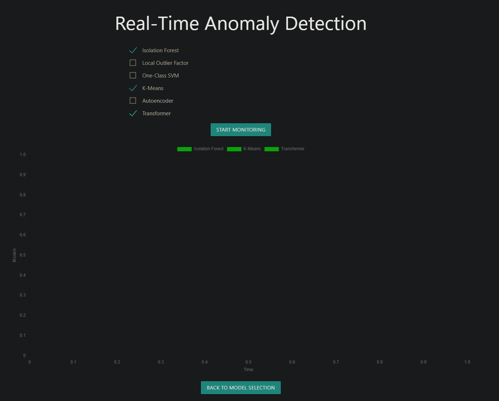

### Next week's goals

- Complete the frontend display of the live data prediction chart
- Look into other simple (not deep learning) architectures for anomaly detection that can work well with high-dimensional data, for comparison with the Transformer model

---

## 9. Week

### Progress

I made the live prediction chart work with the data generator.  
In this new version I switched to a line chart, to make the models easier to distinguish.  
I indicate whether it's an anomaly or not by changing the color of the point (red for anomalies, green for benign data).  

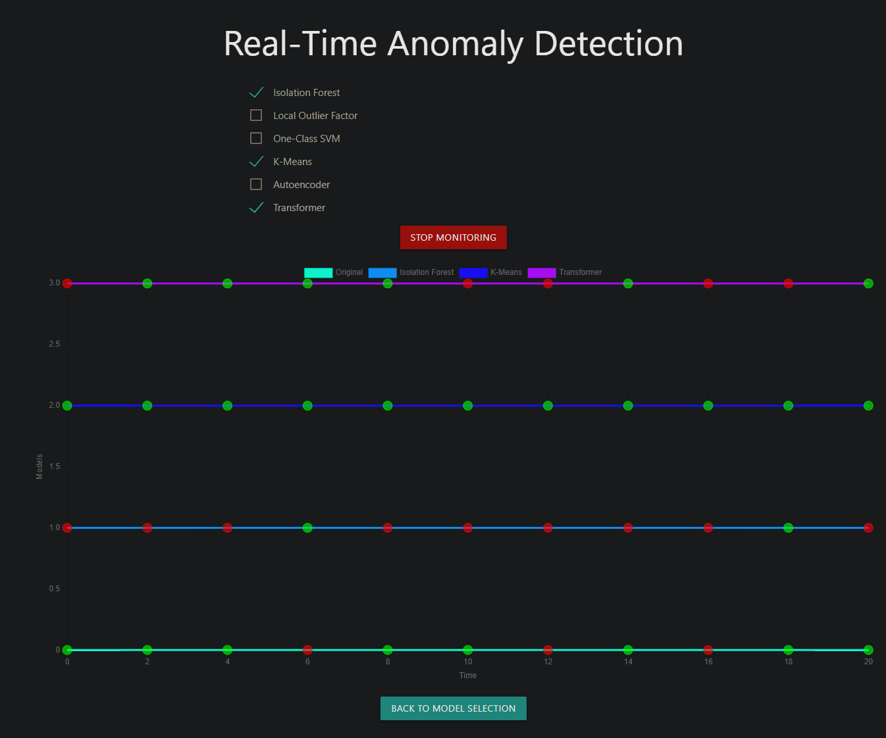  

I added a One-Class Nearest Neighbors model to the project, to test how it performs compared to the other models on high-dimensional data.  

### Next week's goals

- Look into how the very large bot detection dataset could be used with the current models
- Find other architectures that work well with high-dimensional data

---

## 10. Week

### Progress

Trained a new CTGAN model, to generate more accurate synthetic data for the CIC-UNSW-NB15 dataset.

### Next week's goals

- Try to convert bot detection dataset into a format that can be used with the current models, also only use around 0.1% of the data, so that the model can be trained in a reasonable amount of time.

---

## 11. Week

### Progress

Tried to convert the bot detection dataset into a usable format unsuccessfully.

### Next week's goals

- Convert bot detection dataset into a format that can be used with the current models, also only use around 0.1% of the data, so that the model can be trained in a reasonable amount of time.

---

## 12. Week

### Progress

Added presentation for my progress since the 6th week.  
Started working on the bot detection dataset, but it needs new models, as it has text columns (URL) which doesn't work with my current models.  
I started converting my transformer model so that it works with text input as well.
I added a Random Forest and an XGBoost model to the project, as these models work with text input, and compared them on the bot detection dataset.

### Next week's goals

- Make transformer model work with text input
- Add other new models that can work with text input

---

## Sources / References
- https://medium.com/@reza.shokrzad/6-pivotal-anomaly-detection-methods-from-foundations-to-2023s-best-practices-5f037b530ae6
- https://arxiv.org/abs/1901.03407
- https://www.sciencedirect.com/science/article/abs/pii/S1084804515002891
- https://link.springer.com/article/10.1007/s40747-024-01446-8
- <a name="1">[1]</a> J. Hancock, T. M. Khoshgoftaar and J. M. Johnson, "Informative Evaluation Metrics for Highly Imbalanced Big Data Classification," 2022 21st IEEE International Conference on Machine Learning and Applications (ICMLA), Nassau, Bahamas, 2022, pp. 1419-1426, doi: 10.1109/ICMLA55696.2022.00224. keywords: {Measurement;Insurance;Machine learning;Receivers;Big Data;Data models;Robustness;Extremely Randomized Trees;XGBoost;Class Imbalance;Big Data;Undersampling;AUC;AUPRC}  
- <a name="2">[2]</a> https://ieeexplore.ieee.org/abstract/document/9698195
- <a name="3">[3]</a> https://arxiv.org/html/2406.03733v1#S4
- <a name="4">[4]</a> https://github.com/sdv-dev/CTGAN
- <a name="5">[5]</a> https://github.com/sdv-dev/SDV
- <a name="6">[6]</a> https://github.com/joke2k/faker
- Paper about data generation: https://ieeexplore.ieee.org/document/10072179
- <a name="7">[7]</a> H. Mohammadian, A. H. Lashkari, A. Ghorbani. “Poisoning and Evasion: Deep Learning-Based NIDS under Adversarial Attacks,” 21st Annual International Conference on Privacy, Security and Trust (PST), 2024. (https://www.unb.ca/cic/datasets/cic-unsw-nb15.html)

#### List of some papers that use the "Credit Card Fraud Detection" dataset from mlg-ulb:
[comment]: <> (TODO: Add better citations, change them to actual references)
- https://www.mdpi.com/2079-9292/11/4/662
- https://www.researchgate.net/profile/Dr-Kumar-Lilhore/publication/341932015_An_Efficient_Credit_Card_Fraud_Detection_Model_Based_on_Machine_Learning_Methods/links/5ee4a477458515814a5b891e/An-Efficient-Credit-Card-Fraud-Detection-Model-Based-on-Machine-Learning-Methods.pdf
- https://ieeexplore.ieee.org/abstract/document/8979331
- https://ieeexplore.ieee.org/abstract/document/9651991
- https://ieeexplore.ieee.org/abstract/document/9121114
